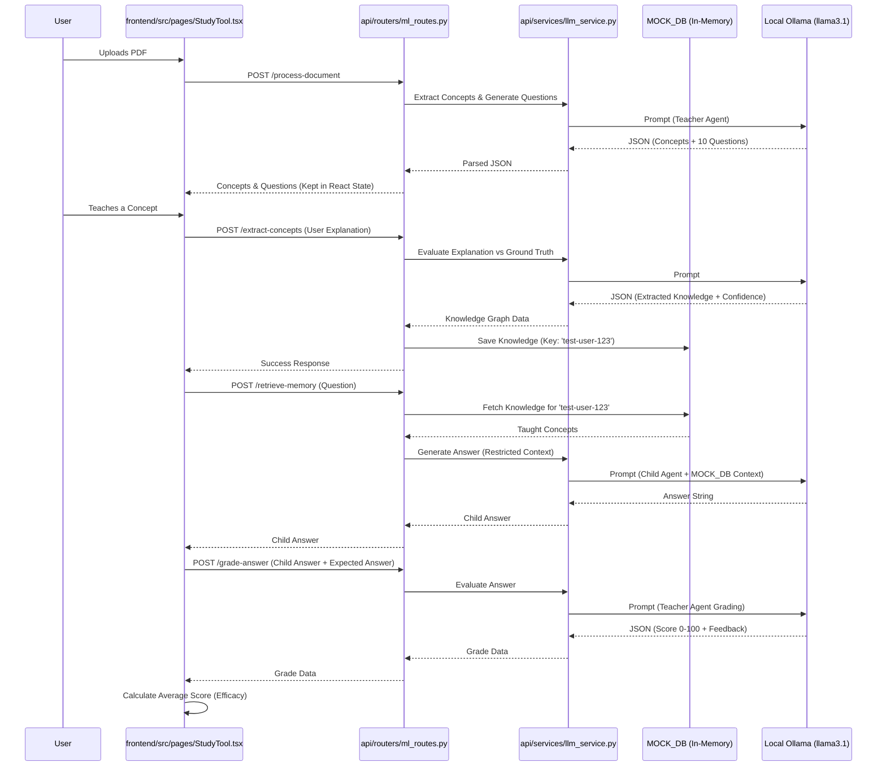

# Study Buddy - Data Flow

This diagram outlines the flow of data through the Study Buddy system, highlighting the lack of persistent storage and the reliance on in-memory state.

## Key Takeaways
1.  **Statelessness**: The FastAPI server relies entirely on `MOCK_DB` in `ml_routes.py`. A server restart wipes the Child Agent's memory.
2.  **Frontend Orchestration**: The frontend (`StudyTool.tsx`) holds the state of the generated questions and iterates through them during the exam phase, passing the necessary data back to the backend for grading.
3.  **Agent Isolation**: The separation between Teacher and Child agents happens entirely in `LLM_Service` via prompt construction. The Child Agent's prompt explicitly injects the data retrieved from `MOCK_DB`.
